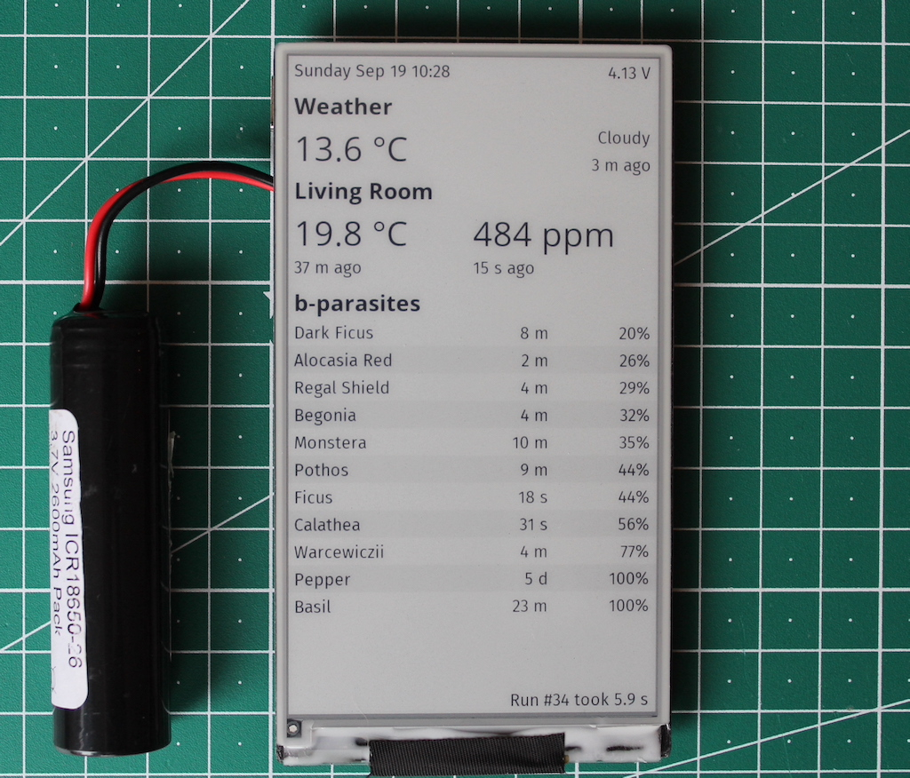

This is a hacky [PlatformIO](https://platformio.org/) project in which Home Assistant data is displayed in an e-ink display.

# Useful Links
* [Display Hardware on Tindie](https://www.tindie.com/products/lilygo/lilygo-t5-47-inch-e-paper-esp32-v3-version/)
* [Official GitHub repo for the display](https://github.com/Xinyuan-LilyGO/LilyGo-EPD47)
  * [Display datasheet](https://github.com/Xinyuan-LilyGO/LilyGo-EPD47/blob/master/Display_datasheet.pdf)
  * [Pin definitions in code](https://github.com/Xinyuan-LilyGO/LilyGo-EPD47/blob/dc05af2a794185abf3540b6027b6ab2a13ec63c6/src/ed097oc4.h)
* Great resource at [cale-idf wiki on GitHub](https://github.com/martinberlin/cale-idf/wiki/Model-parallel-ED047TC1.h)
* [vroland/epdiy](https://github.com/vroland/epdiy): A driver library for eink displays
  * Supports our display

# Dev Notes
## epdiy
Error:
```
.pio/libdeps/esp32dev/epdiy/src/epd_driver/pca9555.c:3:27: fatal error: hal/i2c_types.h: No such file or directory
compilation terminated.
*** [.pio/build/esp32dev/lib9c8/epdiy/epd_driver/pca9555.c.o] Error 1
```

Manually open these files and comment out the #include lines. See [GitHub issue](https://github.com/vroland/epdiy/issues/105).